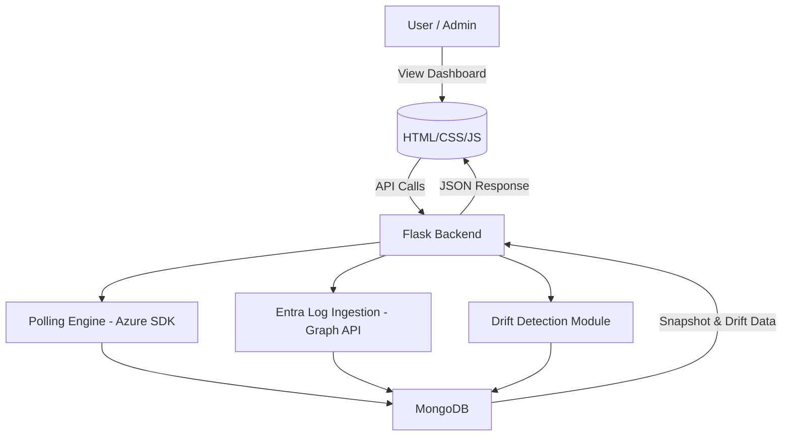

# Drift Management Service

The Drift Management Service is a Python-based system designed to monitor, detect, and report configuration drifts across Azure environments. It securely ingests metadata and Entra ID sign-in logs, compares configuration snapshots over time, and surfaces meaningful changes, particularly those relevant to security.

The system features:
- Periodic polling of Azure configuration data
- Ingestion of Microsoft Entra ID (Azure AD) sign-in logs
- Drift detection using snapshot comparisons
- A minimal web-based dashboard for visibility

## Features

**Automated Polling**: Periodically fetches Azure configuration and metadata (default: every 30 minutes).
**Secure Authentication**: Uses Microsoft Entra ID (Azure AD) app registration with client credentials.
**Log Ingestion**: Collects and stores Entra ID sign-in logs as they become available.
**Snapshot Storage**: Saves configuration snapshots to MongoDB for historical comparison.
**Drift Detection**: Compares recent snapshots and highlights configuration changes using deep diff.
**Web Dashboard**: Provides a lightweight UI to view snapshots and detected drifts.
**Manual Refresh**: Users can trigger an on-demand snapshot collection via the dashboard.

## Architecture Overview

The Drift Management Service consists of the following components:

1. **Frontend (HTML/CSS/JS)**
   - A simple dashboard to view snapshots and trigger manual refreshes.
   - Connects to the backend via REST API endpoints.

2. **Backend (Flask API)**
   - Handles HTTP requests and returns snapshots or drift data.
   - Hosts scheduled jobs using APScheduler for periodic polling.

3. **Polling Engine**
   - Uses Azure SDKs to fetch configuration metadata (e.g., resource groups).
   - Takes a snapshot every 30 minutes (or on-demand) and stores it in MongoDB.

4. **Entra Logs Ingestion**
   - Authenticates with Microsoft Graph API.
   - Retrieves Entra ID sign-in logs and stores them in the database for analysis.

5. **Drift Detection Module**
   - Compares the two most recent snapshots.
   - Uses DeepDiff to compute configuration changes and outputs drift reports.

6. **MongoDB**
   - Stores all snapshots and log data securely.
   - Supports querying for drift detection and dashboard presentation.

## 🗺️ System Architecture (Diagram)

## Installation and Setup

### 1. Clone the Repository

- powersheel
git clone https://github.com/yourusername/blindSpotX_taskTwo.git
cd blindSpotX_taskTwo
python -m venv venv
venv/bin/activate
pip install -r requirements.txt
Create a .env File (env available)
python app.py

## Usage

Once the application is running:

### View Dashboard
- Open your browser and go to: `http://localhost:5000`
- You will see:
  - A list of the latest configuration snapshots
  - A "Refresh Now" button to manually collect a new snapshot

### API Endpoints

| Endpoint            | Method | Description                                      |
|---------------------|--------|--------------------------------------------------|
| `/snapshots`        | GET    | Returns all stored configuration snapshots      |
| `/drift`            | GET    | Returns the latest configuration drift report   |
| `/refresh`          | POST   | Triggers a manual snapshot collection           |

### Snapshot Polling
- By default, a snapshot is automatically collected every 30 minutes using `APScheduler`.

### Log Ingestion
- Entra ID sign-in logs are collected and stored alongside snapshots when available.

### Drift Detection
- Automatically compares the two most recent snapshots and highlights differences using DeepDiff.
- Visit `/drift` or check the dashboard for drift information.

